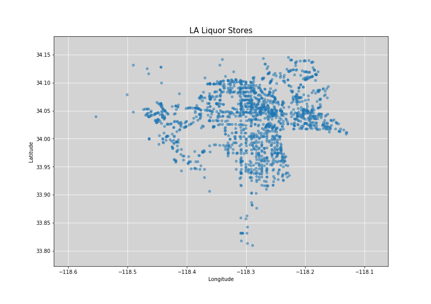
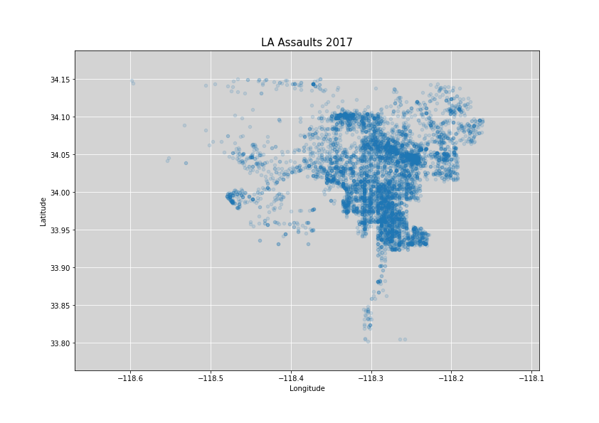
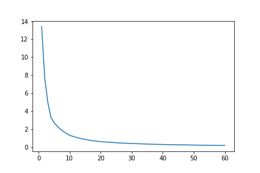

# K-means Clustering Analysis of LA Liquor Stores and Assault Crimes

I decided to do this analysis mainly because I wanted to become more familiar with python's K-means Clustering tools. The idea for this project came from Bill Chambers's [analysis](http://billchambers.me/projects/2015/03/31/kmeans-clustering-sf-crime-data.html) on the relationship between liquor stores and assault in San Francsico. 

In this project I plot the geographic coordinates of liquor stores in Los Angeles and then use K-means Clustering to plot centroids of the store locations. I then repeat these steps except I use the coordinates of assualt crimes in Los Angeles instead coordinates of liquor stores. Finally, I compare the locations of the liquor store and assault centroids to see how near they are. 

### Data Sources
The addresses of the liquor stores came from a data set posted on the [website](https://www.abc.ca.gov/datport/DataExport.html) of the Caliornia Department of Alocholic Beverage Control. To find the latitude and longiutde of the stores, the addresses were fed into google's [geocode api](https://developers.google.com/maps/documentation/geocoding/start).

The assault coordinates were taken from the City of Los Angeles [crime data set](https://data.lacity.org/A-Safe-City/Crime-Data-from-2010-to-Present/y8tr-7khq). This data set contained the latitude and longitude of all assault crimes within the last year. The exact location of the crimes were not given for privacy reasons but the data set does provide coordinates that reflect the nearest 100 block. For example, a crime that actually occured at 241 W Adams Blvd would be given a location of 200 W Adams Blvd in the data set.

### Data Munging


I imported the data set from California Department of ABC and then subsetted the data so that it included only Los Angeles stores and only stores with type 20 or 21 licenses. Type 20 and 21 licenses were chosen because these tend to belong to liquor stores.  


```python
store_locs = pd.read_csv("m_tape460.csv")
store_locs = store_locs.loc[store_locs['Premise City'] == "LOS ANGELES",:]
store_locs = store_locs.loc[(store_locs["License Type"] == 20) | (store_locs["License Type"] == 21) , :]
```

I created a list called 'addresses' with all of the addresses from subsetted data set and iterated through 'addresses', hitting the geocode API with each address.


```python
for address in addresses:
    try:
        r = requests.get('https://maps.googleapis.com/maps/api/geocode/json?address={},+Los+Angeles,+CA&key={}'.format(address, API_KEY))
        lat_long.append(r.json()['results'][0]['geometry']['location'])
        
    except IndexError:
        print("IndexError!")
```

I then turned the latitude and longitude data into a dataframe called 'store_locations' and removed the latitudes and longitudes that were far outside of Los Angeles.


```python
store_locations = pd.DataFrame({"Latitude": lat, "Longitude": lng})

store_locations.loc[store_locations["Longitude"] > -118, :]
store_locations = store_locations.drop([637,1158,1573])
```

The data munging process for the assault coordinates was much easier.

I first imported the City of LA crime data set.


```python
crime_df = pd.read_csv("Crime_Data_from_2010_to_Present.csv")
```

The next major steps were to reduce the data set to assault crimes and to reduce the data set to crimes that had occured within the last year.


```python
crime_df = crime_df.loc[crime_df["Crime Code Description"] == "ASSAULT WITH DEADLY WEAPON, AGGRAVATED ASSAULT", :]

crime_df = crime_df.loc[crime_df["Dates"] > "2017-05-01", :]
```

Next I converted the latitude and longitude values from string to floats and stored them in a latitude list and a longitude list. I noticed that the geographic area of Los Angeles was larger in this dataset than in the liquor store dataset. To account for this difference I shrunk the crime locations data set so that it covered the same area as the liquor store data.


```python
location = pd.DataFrame({"Lati": Lati, "Long": Long})
location = location.loc[location["Lati"] > 33.8, :]
location = location.loc[location["Lati"] < 34.15, :]
location = location.loc[location["Long"] < -118.15, :]
```

### Graphs of Location Data

Liquor stores in Los Angeles:



Assault locations in Los Angeles:



### K-means Centroids

To do the K-means clustering analysis, I used the KMeans class from the sklearn library.


```python
from sklearn.cluster import KMeans
```

One of the first steps when using K-means is to choose how many centroids you want the algorithm to create.

In this project I use the elbow method to get an idea of the appropriate number of centroids to use. The basic idea is you create a graph with number of centroids in the x-axis and on the y-axis you have a value that captures how far awawy points are from their centroids. For that distance from centroid value, I calculated the sum of squares error for each cluster and added them together.

The area of the graph that resembles an elbow is a good guess for the number of centroid you should use.



Looking at the graph, I would say 8 is an appropriate number of centriods to use. 

First, I generate the centriods for the liquor store coordinates.


```python
#Convert the Lat/Long data into a format that the .fit method can use
X = np.array([list(a) for a in zip(store_locations["Longitude"],store_locations["Latitude"] )])

#Run the K-means cluster analysis
kmeans = KMeans(n_clusters= 8, random_state=0).fit(X)

#Create a list for for x and y coordinates of the centriods and append lists with data
cluster_x = []
cluster_y = []

for element in kmeans.cluster_centers_:
    cluster_x.append(element[0])
    cluster_y.append(element[1])
    
#Create a dataframe of the centriod locations for graphing    
centroid_locs = pd.DataFrame({"x_dim":cluster_x, "y_dim":cluster_y})
```

Here is a graph of the centriod locations over the liquor store locations.


Now I repeat the above K-means clustering code using the assault data.

Here is the graph of assault centriods in Los Angeles.


Here is a comparison of the assault clusters and the liquor store clusters. The assualt clusters are red.


## Observations

There is some evidence of a relationship between clusters of liquor stores and clusters of assaults in Los Angeles. The clusters in the north central part of the city and the north east part of the city cover the same area. Also, that empty patch centered at (33.4, -118.375), the Beverly Hills area, has no centriods in it. At the same time, many of the crime centriods are not near the store centroids. I would say there may be a connection between liquor store and assault crime location but there a lot more analysis to do. For example, it would be interesting to sea how clusters of assaults compare with clusters of population in the city. If it turned out assualt centroids were closer to liquor store centriods than population centriods, that would indicate that liquor store density is more predictive of crime density than population densisty is.
